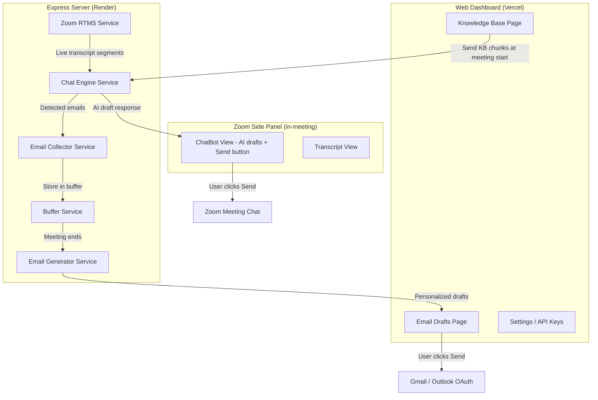

# DealForge Pivot — Final Implementation Plan

## Goal

Transform DealForge from a post-meeting transcript analysis tool into a **real-time AI sales chatbot** for Zoom webinars:

1. Sales team uploads company docs → **Knowledge Base** (RAG with embeddings)
2. During a live Zoom meeting, RTMS captures transcript in real-time
3. **AI Chat Engine** detects attendee questions, generates partial/curiosity-driven answers
4. Drafted responses appear in the **Zoom side panel** → sales person reviews → clicks **"Send to Chat"** (approve-first)
5. AI periodically suggests asking for attendee emails → sales person approves → emails collected from chat
6. After the meeting, AI drafts **personalized follow-up emails** per attendee
7. Sales person reviews each draft → clicks **Send** (via their connected Gmail/Outlook)

## Decisions Locked In

| Decision | Choice |
|----------|--------|
| Chat bot mode | **Approve-first** — AI drafts, human sends |
| Email sending | **User's own Gmail/Outlook** (existing OAuth) |
| Zoom chat mechanism | `zoomSdk.sendMessageToChat()` (pending user verification) |
| Existing code | **Hide, don't delete** — remove from nav, keep in codebase |

## Architecture



## Execution Order

> [!IMPORTANT]
> **Phases 1, 2, 4, 5 have NO Zoom SDK dependency.** We build them now.
> **Phase 3 (Zoom chat send)** waits for you to confirm `sendMessageToChat` works in your Zoom app.

| Phase | What | Zoom-dependent? | Estimated |
|-------|------|-----------------|-----------|
| 1 | Knowledge Base | No | ~3 hours |
| 2 | AI Chat Engine + Email Collector | No | ~3 hours |
| 4 | Email Drafts Page | No | ~2 hours |
| 5 | Dashboard Cleanup + Nav | No | ~1 hour |
| 3 | Zoom ChatBot Panel (sendMessageToChat) | **Yes** | ~2 hours |

---

## Phase 1: Knowledge Base

### [MODIFY] `client/src/services/local-db/db.ts`

Add version 5 with two new tables:

```diff
+ this.version(5).stores({
+   kb_documents: 'id, name, type, uploadedAt',
+   kb_chunks: 'id, docId, text, [docId+index]',
+ });
```

Types to add:
```typescript
interface KBDocument {
  id: string;
  name: string;
  type: 'pdf' | 'txt' | 'md' | 'paste';
  uploadedAt: string;
  chunkCount: number;
  sizeBytes: number;
}

interface KBChunk {
  id: string;
  docId: string;
  text: string;
  embedding: number[];  // 1536-dim from text-embedding-3-small
  index: number;
}
```

### [NEW] `client/src/services/knowledge-base.ts`

Core service with these functions:

- `uploadDocument(file: File | string, apiKey: string)` — reads file, splits into ~500-token chunks with 50-token overlap, generates embeddings via OpenAI, stores in IndexedDB
- `searchKnowledge(query: string, apiKey: string, topK = 5)` — embeds query, cosine similarity search over all chunks, returns top K matches
- `deleteDocument(docId: string)` — deletes document + all its chunks
- `getAllDocuments()` — list all uploaded docs
- `exportChunksForMeeting(docIds?: string[])` — export chunks (text + embedding) for sending to server at meeting start

PDF parsing: use `pdf.js` (already available via CDN or we add `pdfjs-dist` as dependency).

### [NEW] `client/src/pages/dashboard/KnowledgeBasePage.tsx`

UI:
```
┌──────────────────────────────────────────┐
│  Knowledge Base                          │
│  Upload your product docs, FAQs, and     │
│  pricing so the AI can reference them.   │
├──────────────────────────────────────────┤
│                                          │
│  ┌─ Drop zone ────────────────────────┐  │
│  │  📄 Drop PDF, TXT, or MD files    │  │
│  │  or click to browse               │  │
│  │  or paste text below              │  │
│  └────────────────────────────────────┘  │
│                                          │
│  [Paste Text] textarea (collapsible)     │
│                                          │
│  ── Uploaded Documents ──────────────    │
│  📄 product-overview.pdf  12 chunks  🗑  │
│  📄 pricing-faq.txt       8 chunks   🗑  │
│  📄 api-docs.md           24 chunks  🗑  │
│                                          │
│  Total: 44 chunks • Ready for meetings   │
└──────────────────────────────────────────┘
```

Requires OpenAI API key (for embeddings). Shows a prompt to add one in Settings if not configured.

### [NEW] `client/src/services/knowledge-base.test.ts`

Tests for:
- Text chunking (500 tokens, 50 overlap)
- Cosine similarity search returns correct top-K
- Document CRUD operations
- Edge cases: empty file, very long file, special characters

---

## Phase 2: AI Chat Engine + Email Collector

### [NEW] `server/src/services/chat-engine.ts`

The core AI service:

```typescript
interface ChatEngineContext {
  knowledgeChunks: { text: string; embedding: number[] }[];
  companyName: string;
  conversationHistory: { speaker: string; text: string; timestamp: string }[];
}

interface DraftResponse {
  id: string;
  type: 'answer' | 'email_request';
  message: string;            // The draft message for chat
  confidence: number;         // 0-1, how relevant the KB match was
  triggerSegment: string;     // The attendee question that triggered this
  speakerName: string;        // Who asked
  kbSources: string[];        // Which KB chunks were referenced
  createdAt: string;
}

async function processSegments(
  newSegments: TranscriptSegment[],
  context: ChatEngineContext,
  apiKey: string
): Promise<DraftResponse | null>
```

AI Prompt strategy:
```
You are a sales assistant AI for {companyName}. 

RULES:
1. Only respond when an attendee asks a question about the product/service
2. Give a PARTIAL answer — enough to show expertise but leave them wanting more
3. End with something like "I can share more details after the session — drop your email in the chat!"
4. Be professional, concise (2-3 sentences max)
5. Reference specific features/benefits from the knowledge base
6. Do NOT make up information not in the knowledge base

KNOWLEDGE BASE CONTEXT:
{relevantChunks}

RECENT CONVERSATION:
{last10Segments}

ATTENDEE QUESTION:
"{triggerSegment}"

Draft a partial, curiosity-driving response:
```

### [NEW] `server/src/services/email-collector.ts`

```typescript
// Regex-based email extraction from chat/transcript segments
function extractEmails(text: string): string[];

// Associate email with speaker name
function collectEmail(email: string, speakerName: string, meetingId: string): void;

// Get all collected emails for a meeting
function getCollectedEmails(meetingId: string): { email: string; name: string; collectedAt: string }[];
```

### [NEW] `server/src/services/email-generator.ts`

Post-meeting email draft generation:

```typescript
interface EmailDraftRequest {
  attendeeEmail: string;
  attendeeName: string;
  questionsAsked: string[];        // Their specific questions from transcript
  meetingTopic: string;
  companyName: string;
  knowledgeContext: string[];       // Relevant KB chunks for their questions
  apiKey: string;
}

async function generateFollowUpDraft(req: EmailDraftRequest): Promise<{
  subject: string;
  body: string;
}>
```

AI prompt for email drafts:
```
Write a personalized follow-up email from a sales rep to {attendeeName}.

Context: They attended a webinar about {meetingTopic} and asked these questions:
{questionsAsked}

Use this product information to provide FULL answers (unlike the partial in-meeting responses):
{knowledgeContext}

The email should:
1. Thank them for attending
2. Reference their specific questions
3. Provide complete, helpful answers
4. Include a clear CTA (book a demo, start a trial, etc.)
5. Be warm, professional, 150-250 words
```

### [NEW] `server/src/routes/chatbot.ts`

New API routes:
```
POST /api/chatbot/session/start     — Start chat engine for a meeting (receives KB chunks)
POST /api/chatbot/session/end       — End session, trigger email draft generation
GET  /api/chatbot/drafts/:meetingId — Get AI draft responses for the panel
POST /api/chatbot/approve/:draftId  — Mark a draft as approved (for analytics)
GET  /api/chatbot/emails/:meetingId — Get collected emails
POST /api/chatbot/generate-followups — Generate post-meeting email drafts
```

### [MODIFY] `server/src/app.ts`

Mount the new router:
```diff
+ import chatbotRouter from './routes/chatbot';
+ app.use('/api/chatbot', chatbotRouter);
```

### Tests for Phase 2:
- `server/src/services/chat-engine.test.ts`
- `server/src/services/email-collector.test.ts`
- `server/src/services/email-generator.test.ts`
- `server/src/routes/chatbot.test.ts`

---

## Phase 4: Email Drafts Page

### [NEW] `client/src/pages/dashboard/EmailDraftsPage.tsx`

Post-meeting page showing AI-generated follow-up emails:

```
┌──────────────────────────────────────────────┐
│  Follow-up Emails                            │
│  Webinar: "Q3 Product Demo" • 5 attendees    │
├──────────────────────────────────────────────┤
│                                              │
│  ┌─ sarah@techcorp.com ─────────────────┐    │
│  │ Subject: Re: Your question about...  │    │
│  │                                      │    │
│  │ Hi Sarah,                            │    │
│  │ Thanks for joining our demo today... │    │
│  │                                      │    │
│  │ [Edit ✏️]  [Send via Gmail ✉️]       │    │
│  └──────────────────────────────────────┘    │
│                                              │
│  ┌─ john@startup.io ────────────────────┐    │
│  │ Subject: Pricing details you asked   │    │
│  │ ...                                  │    │
│  │ [Edit ✏️]  [Send via Gmail ✉️]       │    │
│  └──────────────────────────────────────┘    │
│                                              │
│  Meeting history:                            │
│  └ Aug 7 — Product Demo (5 emails)  [View]  │
│  └ Aug 5 — Sales Webinar (3 emails) [View]  │
└──────────────────────────────────────────────┘
```

- Uses existing `startEmailOAuth` / `getEmailIntegrationStatus` from `email-integration.ts`
- Sends via existing server route `POST /api/email/send` (already built)
- Editable subject + body with a simple textarea
- "Sent" status tracked per draft

---

## Phase 5: Dashboard Cleanup

### [MODIFY] `client/src/components/layout/DashboardLayout.tsx`

New sidebar:
```diff
  Navigation items:
+ Home (Dashboard overview)
+ Knowledge Base        ← NEW
+ Email Drafts          ← NEW
  Settings
  Billing
- Meetings              ← HIDE
- Leads                 ← HIDE
- Pipeline              ← HIDE
- Analytics             ← HIDE
- Emails (campaigns)    ← HIDE
```

### [MODIFY] `client/src/routes.tsx`

```diff
  // New routes
+ { path: 'knowledge-base', element: <KnowledgeBasePage /> },
+ { path: 'email-drafts', element: <EmailDraftsPage /> },

  // Old routes stay (don't break bookmarks) but hidden from nav
  { path: 'meetings', ... },       // still accessible via URL
  { path: 'leads', ... },          // still accessible via URL
  { path: 'pipeline', ... },       // still accessible via URL
```

### [MODIFY] `client/src/pages/dashboard/DashboardPage.tsx`

Redesign the home dashboard:
- Quick stats: documents uploaded, meetings with chatbot, emails sent
- Recent meeting sessions with chatbot activity
- Quick link to upload docs if knowledge base is empty
- Remove: meeting count, lead count, pipeline stages

### [MODIFY] `client/src/pages/onboarding/OnboardingPage.tsx`

New onboarding steps:
1. **Upload Knowledge Base** (required) — upload at least 1 document
2. **Add AI API Key** (required) — OpenAI key for embeddings + chat
3. **Connect Email** (optional) — Gmail or Outlook for sending follow-ups

Remove: Zoom connect step (happens separately in Settings)

---

## Phase 3: Zoom ChatBot Panel (after SDK verification)

> [!CAUTION]
> **Blocked until you confirm `sendMessageToChat` works.** Everything above can be built and deployed without this.

### [MODIFY] `client/src/components/layout/ZoomPanelLayout.tsx`

Update SDK config:
```diff
  const configResponse = await zoomSdk.config({
    capabilities: [
      'getMeetingContext',
+     'sendMessageToChat',
+     'getChatContext',
    ],
  });
```

New tabs: **Chat Bot** (primary) | **Transcript**
Remove: Notes tab (not needed in new flow)

### [NEW] `client/src/pages/zoom-panel/ChatBotView.tsx`

The main in-meeting view:

```
┌─────────────────────────────────────┐
│  AI Sales Assistant  ● Listening    │
├─────────────────────────────────────┤
│                                     │
│  ┌─ Draft Response ──────────────┐  │
│  │ Attendee asked about pricing  │  │
│  │                               │  │
│  │ "Great question! Our starter  │  │
│  │ plan includes..."             │  │
│  │                               │  │
│  │ [Edit] [Send to Chat ▶]      │  │
│  │ [Dismiss]                     │  │
│  └───────────────────────────────┘  │
│                                     │
│  ── Activity Log ──────────────     │
│  12:03 — Sent answer (pricing)      │
│  12:07 — Sent email request         │
│                                     │
│  ── Emails Collected (3) ──────     │
│  sarah@co.com • john@startup.io     │
│  mike@enterprise.co                 │
├─────────────────────────────────────┤
│  [Pause Bot]                        │
└─────────────────────────────────────┘
```

Flow:
1. Panel opens → sends KB chunks to server via WebSocket
2. Server processes RTMS segments through chat engine
3. Server emits `draft_response` via Socket.IO
4. Panel shows the draft with Edit / Send / Dismiss buttons
5. "Send to Chat" calls `zoomSdk.sendMessageToChat({ message })` 
6. Sent messages logged in activity feed
7. Emails extracted from transcript appear in the collected list

---

## Verification Plan

### Automated Tests

```bash
# All existing tests must still pass
npm run test:server    # 158 existing + new chat engine/collector tests
npm run test:client    # 85 existing + new knowledge base tests

# TypeScript clean
cd client && npx tsc --noEmit
cd server && npx tsc --noEmit

# Production build
npm run build
```

### Manual Verification

| Step | What to verify |
|------|---------------|
| 1 | Upload a PDF to Knowledge Base → chunks appear with count |
| 2 | Upload a .txt file → chunks appear |
| 3 | Delete a document → chunks removed |
| 4 | Dashboard shows updated stats |
| 5 | Onboarding flow: KB upload → API key → Email connect |
| 6 | Old routes (/dashboard/leads, /dashboard/pipeline) still accessible via URL |
| 7 | Sidebar only shows: Home, Knowledge Base, Email Drafts, Settings, Billing |
| 8 | Email Drafts page renders (will be empty until Phase 3 connects it) |

### Phase 3 Manual Verification (after Zoom SDK confirmed)
| Step | What to verify |
|------|---------------|
| 9 | Start a Zoom meeting → ChatBot view loads in side panel |
| 10 | Ask a question in chat → AI draft appears in panel |
| 11 | Click "Send to Chat" → message appears in Zoom chat |
| 12 | Share an email in chat → appears in collected list |
| 13 | End meeting → Email drafts page shows personalized emails |
| 14 | Click Send on an email → delivered via Gmail/Outlook |
