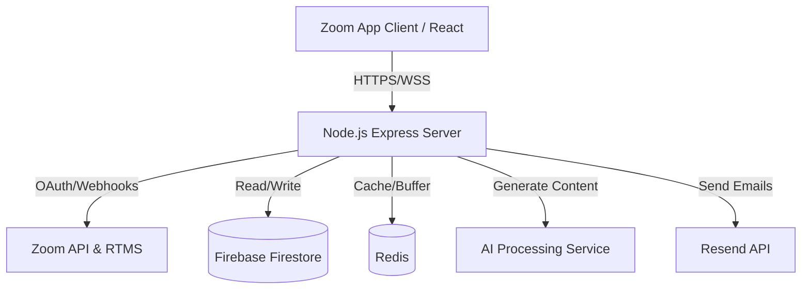

# DealForge - Technical Design Document (TDD)

## 1. Application Overview
**DealForge** is an AI-powered meeting intelligence and CRM integration for Zoom. It leverages Zoom's Real-Time Messaging System (RTMS) and Webhooks to transcribe meetings, extract actionable insights, and automate deal pipeline management for sales teams.

### Core Technologies:
- **Frontend:** React, Vite, TailwindCSS (Zoom App / Meeting Panel)
- **Backend:** Node.js, Express (TypeScript)
- **Database/Persistence:** Firebase Firestore (User data & OAuth tokens), Redis (Session buffering & real-time state)
- **AI/Transcription:** Integration with specialized AI models for real-time natural language processing.
- **Email Outreach:** Resend API for sending post-meeting follow-ups.

---

## 2. Architecture & Data Flow

### 2.1 System Architecture

### 2.2 Zoom Webhook & Real-Time Data Flow
1. **Meeting Starts:** Zoom sends a `meeting.started` webhook to DealForge's `/api/zoom/webhook` endpoint.
2. **Signature Verification:** The server verifies the `x-zm-signature` using the `ZOOM_WEBHOOK_SECRET_TOKEN`.
3. **RTMS Connection:** The server connects to the meeting's Real-Time Messaging System (RTMS) to stream audio/transcriptions.
4. **Processing:** Transcripts are buffered in Redis, then sent to the AI processing pipeline periodically to extract action items, leads, and CRM data.
5. **Client Broadcast:** Processed insights are broadcasted to the connected Zoom App clients via WebSockets (`socket.io`).
6. **Meeting Ends:** On receiving the `meeting.ended` webhook, the RTMS connection is closed, data is flushed to persistent storage, and the cache is cleared.

---

## 3. Security Measures

### 3.1 OAuth & Secret Management
- **Token Storage:** Zoom OAuth tokens (access & refresh) are securely stored in Firebase Firestore associated with the authenticated user's ID.
- **Environment Variables:** Credentials (e.g., `ZOOM_CLIENT_SECRET`, `ZOOM_WEBHOOK_SECRET_TOKEN`, `FIREBASE_PRIVATE_KEY`) are managed strictly via environment variables and are never checked into version control.
- **Deauthorization:** The `/api/zoom/deauth` webhook endpoint listens for deauthorization events and instantly removes all Zoom tokens and associated user PII from the database.

### 3.2 Webhook Security
- **Challenge-Response Check (CRC):** The webhook endpoint natively handles the `endpoint.url_validation` event by hashing the provided `plainToken` using HMAC-SHA256 and the Webhook Secret Token.
- **Event Verification:** All incoming webhook events are strictly verified against the `x-zm-signature` and `x-zm-request-timestamp` headers to prevent spoofing and replay attacks.

### 3.3 Data Privacy & Encryption
- **Data in Transit:** All communications between the Zoom Client, Zoom API, and DealForge servers are encrypted using TLS 1.2 or higher (HTTPS/WSS).
- **Data at Rest:** Data stored in Firebase Firestore is encrypted at rest by Google Cloud.
- **Data Retention:** Transcripts and meeting notes are buffered in Redis temporarily during active meetings and are cleared shortly after the `meeting.ended` event is processed. Only aggregated AI insights are persistently stored in the user's CRM pipeline.

---

## 4. Required OAuth Scopes Justification
- `meeting:read`: Required to receive webhooks (`meeting.started`, `meeting.ended`) and connect to RTMS.
- `recording:read`: Used to analyze past meeting recordings for CRM extraction if the user triggers a retroactive analysis.
- `user:read`: Required to associate the Zoom account with the DealForge user profile and verify meeting participant identity.
