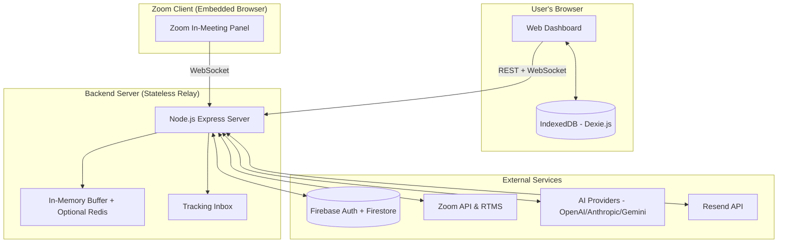

# DealForge - Technical Design Document (TDD)

## 1. Application Overview
**DealForge** is an AI-powered meeting intelligence and CRM integration for Zoom. It leverages Zoom's Real-Time Messaging System (RTMS) and Webhooks to transcribe meetings, extract actionable insights, and automate deal pipeline management for sales teams.

### Core Technologies:
- **Frontend:** React 19, Vite, TypeScript, Dexie.js (IndexedDB), Zustand (state management), Socket.io Client
- **Backend:** Node.js, Express, TypeScript, Socket.io
- **Database/Persistence:** Firebase Firestore (User data & OAuth tokens), IndexedDB via Dexie.js (Local-first sensitive data), In-memory buffer with optional Redis (Session buffering, 24h TTL)
- **AI/Transcription:** Zoom RTMS for real-time transcription, OpenAI/Anthropic/Google GenAI for analysis (BYOK)
- **Email Outreach:** Resend API for sending post-meeting follow-ups.

---

## 2. Architecture & Data Flow

### 2.1 System Architecture

### 2.2 Zoom Webhook & Real-Time Data Flow
1. **Meeting Starts:** Zoom sends a `meeting.started` webhook to DealForge's `/api/zoom/webhook` endpoint.
2. **Signature Verification:** The server verifies the `x-zm-signature` using the `ZOOM_WEBHOOK_SECRET_TOKEN`.
3. **RTMS Connection:** The server connects to the meeting's Real-Time Messaging System (RTMS) to stream audio/transcriptions.
4. **Processing:** Transcripts are buffered in-memory (with optional Redis for production durability, 24h TTL), then sent to the AI processing pipeline periodically (every 45 seconds) to extract action items, leads, and CRM data.
5. **Client Broadcast:** Processed insights are broadcasted to the connected Zoom App clients via WebSockets (`socket.io`).
6. **Data Storage:** Sensitive data (transcripts, leads, emails, analytics) is stored locally in IndexedDB via Dexie.js. The server acts as a stateless relay.
7. **Meeting Ends:** On receiving the `meeting.ended` webhook, the RTMS connection is closed, and the buffer is cleared after dashboard pulls data.

---

## 3. Security Measures

### 3.1 OAuth & Secret Management
- **Token Storage:** Zoom OAuth tokens (access & refresh) are securely stored in Firebase Firestore associated with the authenticated user's ID.
- **Environment Variables:** Credentials (e.g., `ZOOM_CLIENT_SECRET`, `ZOOM_WEBHOOK_SECRET_TOKEN`, `FIREBASE_PRIVATE_KEY`) are managed strictly via environment variables and are never checked into version control.
- **Deauthorization:** The `/api/zoom/deauth` webhook endpoint listens for deauthorization events and instantly removes all Zoom tokens and associated user PII from the database.

### 3.2 Webhook Security
- **Challenge-Response Check (CRC):** The webhook endpoint natively handles the `endpoint.url_validation` event by hashing the provided `plainToken` using HMAC-SHA256 and the Webhook Secret Token.
- **Event Verification:** All incoming webhook events are strictly verified against the `x-zm-signature` and `x-zm-request-timestamp` headers to prevent spoofing and replay attacks.

### 3.3 Data Privacy & Encryption
- **Data in Transit:** All communications between the Zoom Client, Zoom API, and DealForge servers are encrypted using TLS 1.2 or higher (HTTPS/WSS).
- **Data at Rest:** Data stored in Firebase Firestore is encrypted at rest by Google Cloud. Sensitive data (transcripts, leads, emails) is stored locally in IndexedDB, not on the server.
- **Data Retention:** Transcripts and meeting notes are buffered in-memory temporarily during active meetings (with optional Redis for production durability, 24h TTL). Once the dashboard pulls the data, the server discards it. Sensitive data is never permanently stored on the server.
- **BYOK (Bring Your Own Key):** API keys for AI providers are encrypted client-side using PBKDF2 and stored in Firestore. The server never sees plaintext keys.

---

## 4. Required OAuth Scopes Justification
- `meeting:read`: Required to receive webhooks (`meeting.started`, `meeting.ended`) and connect to RTMS.
- `recording:read`: Used to analyze past meeting recordings for CRM extraction if the user triggers a retroactive analysis.
- `user:read`: Required to associate the Zoom account with the DealForge user profile and verify meeting participant identity.
